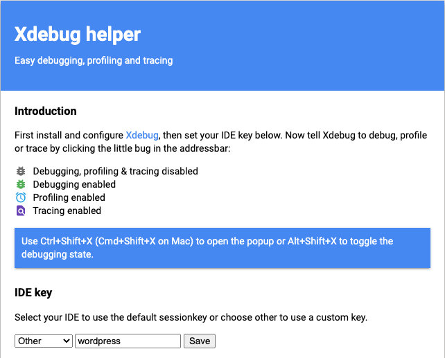
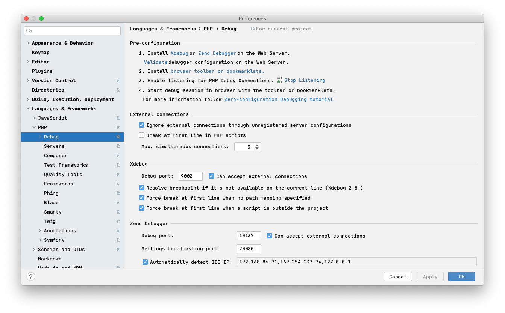
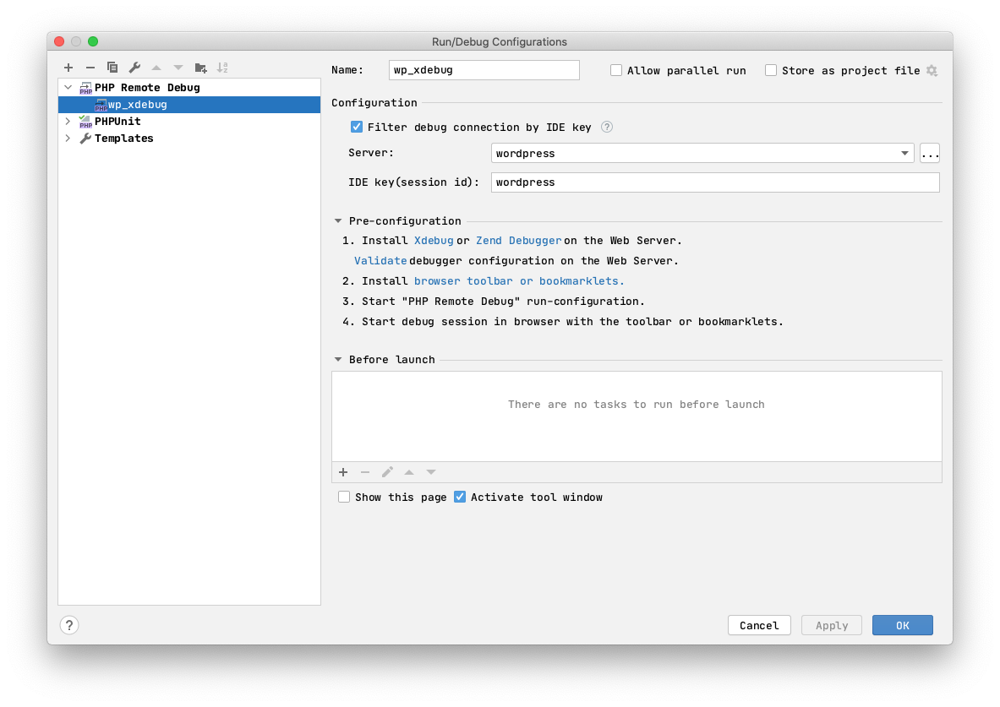
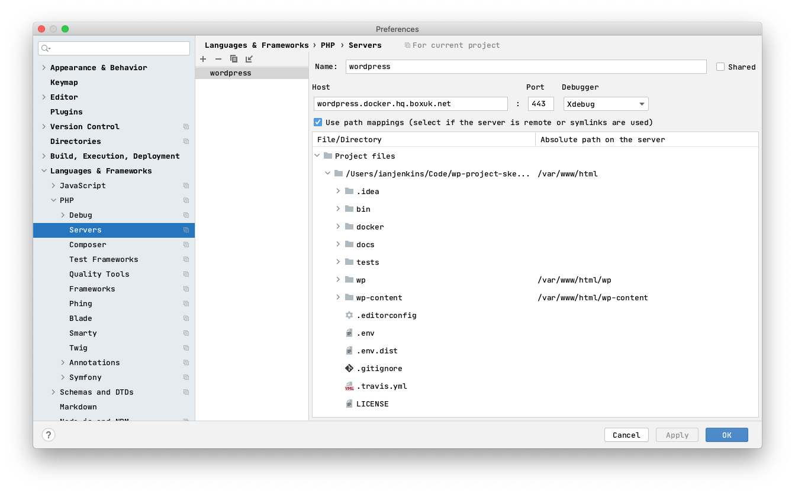

# Docker Setup

If you just want a ready to go docker environment you can just use the [quickstart](quickstart.md), do read on though if you're after more detail.

### Pre-requisites
#### Pre-requisites for Windows systems
* [WSL](https://docs.microsoft.com/en-us/windows/wsl/install)
* [Linux Kernel Update Package](https://docs.microsoft.com/en-gb/windows/wsl/install-manual#step-4---download-the-linux-kernel-update-package)
* [Cygwin](https://cygwin.com/install.html) (be sure to include the gettext package on install)
#### Pre-requisites for all systems
* [Docker](https://www.docker.com/)
* [Docker compose](https://docs.docker.com/compose/install/)

### Env Vars

You will also need to set up a bunch of environment variables

#### .env

Create a `.env` file based on `.env.dist`.

On Linux systems you will want to set `USER_ID` and
`GROUP_ID` to the uid/gid of your primary user. These
do not need to be set on Windows/Mac systems.

#### ./docker/database/.env

Create the `.env` file baed on `.env.dist`.

It is recommended to change the default passwords even
for development environments.

#### ./docker/app/.env

Create the `.env` file based on `.env.dist`.

It is recommended to change the default passwords even
for development environments.

> Env vars declared here will override any vars declared in the `.env` file in the root. See the header comment within the root `.env.dist` for an explanation as to why, baring in mind that in this context the 'real' environment is docker.

### Hosts file entries

`127.0.0.1 $PROJECT_NAME.local`

> If you want to change this you can, but you will need to make a change to `WP_HOME` in `./docker/app/.env`.

### Create environment

* `docker network create --subnet=192.168.35.0/24 $DOCKER_NETWORK_NAME`

> The docker network is required to ensure the loopback works with the expected IP address.

* `docker-compose build`

> This only needs to be called once to build the image(s)

* Use `docker-compose up` to build the containers. You'll only need to use this the first time.

* Use `docker-compose start` to start the container

* Use `docker-compose stop` to stop the container (without removing the volumes).

> Using docker-compose down stops containers but also removes them. This will lead to loss of data (e.g. your database).

That's it! You should now be able to browse to `https://$PROJECT_NAME.local` (or whatever you set) and view the site. Note, at time of writing you will need to go through the install script to have WordPress set up.

### Mailhog

This docker environment uses mailhog to catch emails generated
from the application. Visit the mailhog instance by going to
http://$PROJECT_NAME.local:8025

### Blackfire

Blackfire is available (though disabled by default), you just need to enter [your credentials](https://blackfire.io/my/settings/credentials)

`cp docker/blackfire/.env.dist cp docker/blackfire/.env`

> Then enter your details in the .env file and run `bash bin/docker/enable_blackfire`.

### Running with Mac (And Docker Desktop)

#### Xdebug

We are running 2 app containers. By default, you will be using an xdebug-free container.
This speeds up local env in browser and CLI as they no longer run xdebug for every request.

**Setup**

 - Download a browser extension for your browser from https://www.jetbrains.com/help/phpstorm/2020.2/browser-debugging-extensions.html
 - Configure the browser extension to make sure the IDE key matches the one set in your `./docker/app/.env` (by default it is `wordpress`)



 - Ensure your IDE is set up correctly. Screenshots below show PhpStorm setup as an example.







 - To run xdebug in the browser: enable it in your IDE; add breakpoints; then go to your browser; enable xdebug in the browser extension (from first step of the setup) and reload the page.
 - To run xdebug in CLI: enable it in your IDE; add breakpoints; then execute the CLI command:

```
     docker-compose exec --user www-data app_xdebug php index.php
```

Or, use one of the helper scripts located in `./bin/docker/xdebug`

> On linux, remember to set `remote_host` to `192.168.35.1`

### Running composer or wp-cli

If you wish to run composer or wp-cli there are two bin scripts that will allow you to run directly on the container:

`bin/docker/composer`
`bin/docker/wp`


